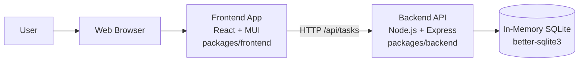
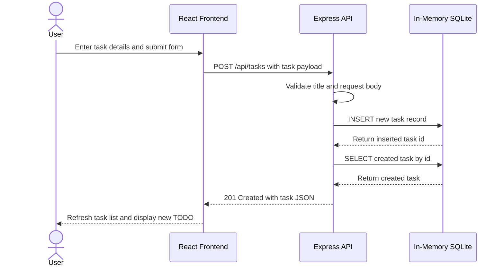

# Cloud Architecture Overview

This monorepo is a simple two-tier application with a browser-based frontend and a Node.js backend API. In the current implementation, data is stored in an in-memory SQLite database inside the backend process, so persistence lasts only for the life of the running server.

## System Context

## Sequence Diagram: Create a TODO

## Notes

- The frontend runs as a React application from the monorepo frontend package.
- The frontend calls the backend through `/api/tasks` endpoints.
- The backend runs as an Express service from the monorepo backend package.
- The database is not an external cloud service; it is an in-memory SQLite instance embedded in the backend process.
- No separate authentication, queueing, object storage, or third-party cloud services are present in the current repo.
